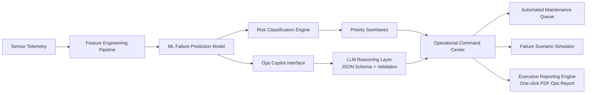

# 🚀 FleetMind AI — Predictive Maintenance Command Center
### AI • Machine Learning • Decision Intelligence • Operational Systems

---

## 🧭 Executive Summary

FleetMind is a production-style machine learning platform engineered to **predict equipment failure before it occurs**, prioritize operational risk across an entire fleet, and deliver AI-assisted maintenance recommendations through an LLM-powered Copilot.

Unlike traditional ML projects that stop at prediction, FleetMind provides a **decision-grade operational interface** capable of supporting real-world reliability engineering workflows.

This platform reflects the architecture, engineering rigor, and systems thinking expected from modern Machine Learning Engineers.

---

## 🌍 Why This Project Matters

Unplanned industrial downtime costs the global economy **hundreds of billions of dollars annually**.

Most ML solutions generate predictions.

Very few solve the harder problem:

> **Transforming predictions into operational decisions.**

FleetMind was built to close that gap.

By converting raw sensor telemetry into prioritized maintenance actions, the platform enables organizations to transition from reactive maintenance toward intelligence-driven operations.

---

# ⭐ Platform Capabilities

---

## 🔮 Predict Failure Before It Happens
- Remaining Useful Life (RUL) prediction  
- Health index scoring  
- Dynamic risk classification  
- Threshold-based decisioning  

---

## 🧠 Fleet Command Center
A real-time operational control layer designed for reliability teams.

**Key Features:**

- Fleet-wide risk posture  
- Priority swimlanes  
- Automated maintenance queue  
- Decision indicators  
- Next-action recommendations  

Built with executive-level clarity to support high-stakes operational environments.

---

## 🤖 Ops Copilot (LLM Decision Engine)

FleetMind integrates a structured AI Copilot capable of:

✅ Diagnosing likely failure drivers  
✅ Explaining risk signals  
✅ Generating prioritized actions  
✅ Asking operational follow-ups  
✅ Producing schema-validated outputs  

> **Production Safety Principle:**  
Malformed LLM responses are schema-validated before entering the system — ensuring the application never crashes.

This mirrors defensive engineering patterns used in real production ML systems.

---

## 🧪 Failure Scenario Simulator

A parameterized simulation engine enables operators to stress-test fleet behavior under realistic degradation patterns:

- Bearing instability  
- Thermal runaway  
- Compressor shock events  
- Sensor drift  
- Gradual mechanical wear  

This allows teams to shift from reactive firefighting → proactive planning.

---

## ⏳ Projected Failure Countdown

Forecasts when engines are likely to cross operational thresholds.

**Provides:**
- Risk countdown  
- Confidence bands  
- Planning visibility  

Supports maintenance scheduling before escalation occurs.

---

## 🛠 Automated Maintenance Queue

FleetMind converts model outputs into clear operational actions:

| Decision | Action |
|--------|------------|
| **SERVICE_NOW** | Immediate intervention |
| **MONITOR** | Scheduled inspection |
| **OK** | Continue operation |

Engines are ranked automatically — optimizing operator attention where it matters most.

---

## 📄 One-Click Executive Reporting

Generates leadership-ready PDF reports containing:

- Fleet snapshot  
- Risk distribution  
- Copilot insights  
- Recommended actions  
- Engine trajectory  

Designed for executive visibility and decision support.

---

## 🏗️ Architecture Overview

FleetMind was intentionally designed as a modular ML platform .



## 🧠 Architectural Philosophy


FleetMind is engineered using design principles commonly found in modern production machine learning platforms.

The system prioritizes **reliability, modularity, safety, and operational clarity** — ensuring that predictive intelligence translates into real-world decision support.

---

## ✅ Modular System Design

FleetMind is intentionally decomposed into isolated, reusable components.

### src/app/panels/
Each operational capability exists as an independent panel, enabling clean architectural boundaries.

### Why This Matters
- Improves long-term maintainability  
- Enables rapid feature iteration  
- Prevents monolithic system complexity  
- Supports enterprise-scale extensibility  

This mirrors how high-performing ML platforms evolve in production environments.

---

## ✅ LLM Abstraction Layer

###src/copilot/

The AI reasoning layer is fully decoupled from application logic.

### Architectural Advantage
This separation allows:

- Future LLM provider swaps  
- Independent prompt evolution  
- Safe experimentation  
- Reduced architectural friction  

A critical pattern for teams building AI-powered operational systems.

---

## ✅ Schema-Enforced AI Responses

Every Copilot response is validated against a strict schema before entering the application.

### This Prevents:
- UI failures  
- malformed outputs  
- runtime unpredictability  
- downstream system corruption  

> **Production Insight:**  
Unstructured LLM responses are one of the fastest ways to destabilize AI systems.  
FleetMind eliminates this risk through schema enforcement.

---

## ✅ Safe Fallback Strategy

Operational platforms must never fail due to model unavailability.

FleetMind implements a resilience layer:

**If the LLM becomes unavailable → Mock Copilot activates automatically.**

✔ Application remains fully operational  
✔ Decision workflows continue  
✔ User experience is preserved  

Reliability is treated as a core architectural feature — not an afterthought.

---

## ✅ Stateful UX Architecture

FleetMind leverages session-state persistence to deliver a seamless operational experience.

### Guarantees:
- Engine selections survive reruns  
- Simulation parameters remain stable  
- Copilot outputs persist  
- Decision context is preserved  

This prevents cognitive friction for operators working in high-focus environments.

---

# ⚙️ Technology Stack

FleetMind integrates machine learning, AI reasoning, and operational UI into a cohesive production-style platform.

---

## 🧮 Machine Learning Layer
- Random Forest predictive modeling  
- Rolling statistical feature engineering  
- Health index generation  
- Threshold-based risk decisioning  

Designed for interpretability and operational reliability.

---

## 🤖 AI Reasoning Layer
- OpenAI structured reasoning  
- JSON schema enforcement  
- Deterministic temperature tuning  

Ensures predictable and explainable AI-assisted recommendations.

---

## 🏗 Application Layer
- Streamlit production-style architecture  
- Panel-based modular UI  
- Resilient session state management  

Built to simulate real operational tooling rather than experimental dashboards.

---

## 📊 Visualization Layer
- Plotly interactive analytics  
- Executive-grade dashboard styling  
- Premium dark theme optimized for readability  

Prioritizes signal clarity over visual noise.

---

# 🔄 Example Operational Flow

FleetMind mirrors real-world reliability pipelines:

1️⃣ Sensor telemetry enters the platform  
2️⃣ Features are engineered  
3️⃣ ML model predicts Remaining Useful Life (RUL)  
4️⃣ Risk engine classifies operational priority  
5️⃣ Ops Copilot explains failure drivers  
6️⃣ Maintenance queue auto-generates  
7️⃣ Executive report exports  

> **Prediction → Decision → Action**

This is the core loop of modern intelligent operations.

---

# 🧩 Engineering Challenges Solved

Building decision-grade ML systems requires solving problems beyond modeling.

---

### ✅ Preventing LLM Schema Drift
Implemented strict response validation to enforce structural integrity across AI outputs.

---

### ✅ Designing Failure-Resilient UX
Fallback layers ensure the platform never crashes — even during AI outages.

---

### ✅ Bridging Prediction → Decision
Translated statistical outputs into operational workflows that teams can act upon immediately.

---

### ✅ Simulating Realistic Degradation
Developed parameterized failure models to emulate real industrial behavior and stress-test decision logic.

---

# 📊 Modeled Business Impact

Industry research suggests predictive maintenance can reduce downtime by **30–50%**.

FleetMind demonstrates how such outcomes become operationally achievable through intelligent system design.

---

# 🚀 Running Locally

```bash
git clone <your-repo>
cd fleetmind

pip install -r requirements.txt
streamlit run src/app/dashboard.py

###🔐 Environment Setup
Create a .env file:
OPENAI_API_KEY=your_key

### About the Engineer
## Ranjith Kumar Maddirala

Focused on designing intelligent systems that transform data into operational decisions.

## Core Interests
Machine Learning Systems

Applied Artificial Intelligence

Predictive Analytics

Decision Intelligence Platforms

Reliability Engineering

