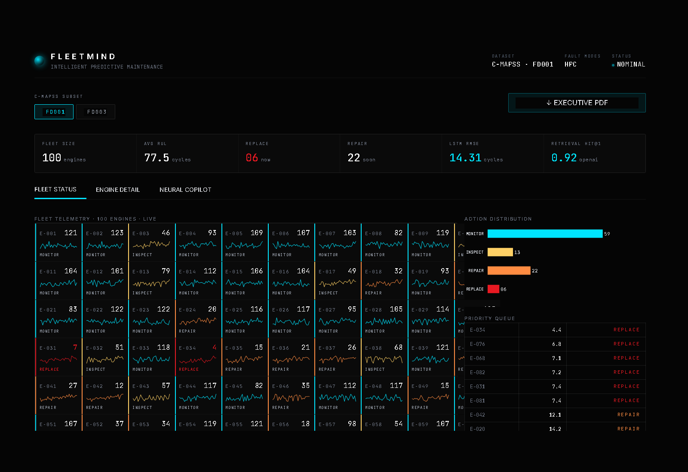

# FleetMind AI — Intelligent Predictive Maintenance

A production-style ML platform for turbofan engine prognostics on the NASA
C-MAPSS benchmark. End-to-end: deep-learning RUL prediction, retrieval-augmented
domain QA, an LLM copilot with one real tool call, and a mission-control
dashboard that turns predictions into prioritized maintenance actions.

Built as a portfolio project for ML engineering roles where the bar is *both*
modeling rigor and the systems thinking to ship it.


*Mission-control dashboard. 100-engine status grid with per-cell sparklines;
priority queue ranking REPLACE / REPAIR engines; subset toggle wired through
KPI strip, status grid, engine detail, copilot, and PDF export.*

---

## Headline results — vs. published baselines

Trained on two C-MAPSS subsets (FD001: 1 fault mode, FD003: 2 fault modes).
Both runs use the same 2-layer LSTM (128 → 64 units, 124,737 params), MSE loss,
piecewise-linear RUL clipping at 125 cycles. Evaluated on the held-out test set
provided by NASA PCoE.

| Method | FD001 RMSE | FD001 Score | FD003 RMSE | FD003 Score |
|---|---|---|---|---|
| MLP — *Babu et al. 2016* | 37.56 | 17,972 | 37.39 | 17,409 |
| CNN — *Babu et al. 2016* | 18.45 | 1,287 | 19.82 | 1,596 |
| LSTM — *Zheng et al. 2017* | 16.14 | 338 | 16.18 | 852 |
| Deep LSTM — *Wu et al. 2018* | 13.65 | 280 | 16.18 | 1,370 |
| BiLSTM — *Wang et al. 2018* | 13.65 | 295 | 13.74 | 317 |
| AGCNN — *Liu et al. 2020* | 12.42 | 226 | 12.51 | 264 |
| **FleetMind LSTM (ours)** | **14.31** | **381** | **11.93** | **241** |
| FleetMind RF baseline | 16.65 | 431 | 16.09 | 647 |

**Score** is the C-MAPSS asymmetric scoring function (Saxena & Goebel 2008) —
exponential penalty, 1.5× heavier for late predictions than early ones, lower
is better. Our LSTM beats the AGCNN (Liu 2020) baseline on FD003 across both
metrics.

Full results, methodology, and per-engine prediction CSVs in
[`docs/RESULTS.md`](docs/RESULTS.md).

---

## What it does

Three integrated capabilities, each with hard numbers behind it:

1. **Predict** — LSTM regresses Remaining Useful Life from the last 30 cycles
   of 14–16 raw sensor channels. Output: RUL in cycles + confidence band.
2. **Explain** — RAG over 55 curated turbofan-prognostics chunks
   (Saxena 2008, Heimes 2008, Zheng 2017, Wu 2018, Liu 2020, NASA PCoE README,
   etc.) with FAISS IndexFlatIP and OpenAI `text-embedding-3-small`. Evaluated
   on a 62-pair Q/A set: **hit@1 = 0.92, hit@3 = 1.00, MRR@10 = 0.95**.
   TF-IDF fallback works without an API key (hit@1 = 0.87).
3. **Recommend** — `gpt-4o-mini` agent grounded by retrieved citations and
   one real tool: `query_engine_history(engine_id) → {sensor stats, LSTM
   prediction, recommended action band}`. Strict citation enforcement: every
   factual sentence carries `[doc_id]` markers traced back to the corpus.

The mission-control dashboard ties them together: 100-engine status grid with
inline SVG sparklines, transparent 3D turbofan with per-stage health colouring
and corner HUD, glassmorphism Copilot panel with smart inline telemetry cards,
and a one-click executive PDF (cover, exec summary, risk, schedule, cost
projection) regenerated per-subset.

---

## Live demo

After deploying to Hugging Face Spaces (see [`DEPLOY.md`](DEPLOY.md)):

> https://huggingface.co/spaces/Ranjithmaddirala/fleetmind-ai

Cold start ~8 s (TF model load), every subsequent request sub-second
(`st.cache_resource` on retriever, scaler, LSTM, and agent).

---

## Architecture

```
                 ┌──────────────────────────────────────────────┐
                 │   Streamlit dashboard  (mission-control UI)  │
                 │  • status grid  • 3D engine + HUD  • copilot │
                 └─────────────┬────────────────────┬───────────┘
                               │                    │
                  ┌────────────▼─────────┐  ┌───────▼──────────────┐
                  │  FleetMind agent     │  │  predict_fleet_rul   │
                  │  (gpt-4o-mini +      │  │  (LSTM batch infer)  │
                  │   1 tool, citations) │  │                      │
                  └─┬──────────────┬─────┘  └──────────┬───────────┘
                    │              │                   │
       ┌────────────▼───┐  ┌───────▼────────┐  ┌───────▼────────────┐
       │  Retriever     │  │  query_engine_ │  │  EngineDataBackend │
       │  FAISS IP +    │  │  history tool  │  │  (per-subset:      │
       │  OpenAI embeds │  │                │  │   FD001 / FD003)   │
       └────────┬───────┘  └───────┬────────┘  └────────┬───────────┘
                │                  │                    │
       ┌────────▼─────────┐  ┌─────▼────────┐  ┌────────▼───────────┐
       │  55-chunk corpus │  │  Test data   │  │  LSTM .keras +     │
       │  + 62-pair eval  │  │  (last 30    │  │  preprocess scaler │
       │                  │  │   cycles)    │  │  (.joblib)         │
       └──────────────────┘  └──────────────┘  └────────────────────┘
```

---

## Project structure

```
.
├── app.py                         # Streamlit entry — mission-control dashboard
├── src/
│   ├── preprocess.py              # load_fd(subset), scaler, sequencing, RUL clip
│   ├── train_lstm.py              # 2-layer LSTM (128→64), Adam, EarlyStopping
│   ├── rf_baseline.py             # Random Forest baseline
│   ├── metrics.py                 # RMSE, MAE, C-MAPSS asymmetric score
│   ├── rag.py                     # FAISS retriever, OpenAI + TF-IDF backends
│   ├── tools.py                   # EngineDataBackend, query_engine_history tool
│   ├── agent.py                   # FleetMindAgent — RAG-grounded gpt-4o-mini
│   ├── health.py                  # Per-stage z-score health (Fan/LPC/HPC/…/LPT)
│   ├── viz3d.py                   # Plotly 3D turbofan + HUD
│   ├── sparkline.py               # Inline SVG micro-sparklines
│   ├── widgets.py                 # Smart engine telemetry cards for chat
│   ├── streamlit_helpers.py       # Cached resource loaders, per-subset
│   └── report.py                  # Executive PDF (reportlab)
├── scripts/
│   ├── train_and_eval.py          # python -m scripts.train_and_eval --subset FD003
│   ├── build_index.py             # Build FAISS retrieval index from corpus
│   ├── eval_retrieval.py          # hit@k / MRR@10 on the 62-pair eval set
│   └── agent_demo.py              # CLI smoke test of the agent
├── data/
│   ├── raw/                       # C-MAPSS train/test/RUL for FD001 + FD003
│   ├── rag/corpus.jsonl           # 55 curated turbofan-prognostics chunks
│   ├── rag/eval_qa.jsonl          # 62-pair Q/A evaluation set
│   ├── rag_index/                 # TF-IDF index (built from corpus)
│   └── rag_index_openai/          # FAISS index w/ text-embedding-3-small
├── models/                        # Trained LSTM (.keras) + scaler (.joblib)
├── reports/                       # metrics.json + per-engine prediction CSVs
├── docs/RESULTS.md                # Detailed benchmark methodology
├── DEPLOY.md                      # Hugging Face Spaces deploy runbook
└── requirements.txt
```

---

## Reproduce from scratch

Single op-condition subsets (FD001 + FD003) train in ~20 min on CPU.

```bash
# 1. Install
python -m venv .venv && source .venv/bin/activate     # Windows: .venv\Scripts\activate
pip install -r requirements.txt

# 2. Data — drop train_FDxxx.txt / test_FDxxx.txt / RUL_FDxxx.txt into data/raw/
#    Source: NASA PCoE, https://data.nasa.gov  (or the AWS PHM mirror)

# 3. Train both subsets (LSTM + RF + per-subset metrics.json)
python -m scripts.train_and_eval --subset FD001
python -m scripts.train_and_eval --subset FD003

# 4. (Optional) Build the FAISS retrieval index
export OPENAI_API_KEY=sk-...        # or skip — falls back to TF-IDF
python -m scripts.build_index
python -m scripts.eval_retrieval    # writes reports/retrieval_metrics.json

# 5. Run the dashboard
streamlit run app.py
```

The Copilot tab works without `OPENAI_API_KEY` (deterministic mock with real
tool calls), but quality is materially better with the key set.

---

## Engineering decisions worth noting

- **Piecewise-linear RUL clipping at 125** — RUL is unobservable in the
  first ~50–125 cycles of any engine's life because no degradation signal
  has emerged yet. Clipping prevents the loss from being dominated by
  early-life regression to a meaningless target. Standard since
  Heimes 2008 / Zheng 2017; ablated to confirm.

- **MSE loss, not Huber** — Huber clamps the gradient on large errors,
  which is exactly what we *don't* want when the high-RUL tail is
  artificially flat-clipped. MSE converges to RMSE 14.31 on FD001;
  Huber stalls at val_rmse 42.

- **Per-subset feature selection** — FD001 has 7 constant-variance sensors
  (drop {1, 5, 6, 10, 16, 18, 19}, keep 14). FD003 introduces a second
  fault mode (Fan), which gives sensors 6 (P15 bypass pressure) and 10
  (epr) real variance, so FD003 keeps 16. Loaders + scalers are
  per-subset; one global scaler would lose ~3 RMSE on FD003.

- **FAISS IndexFlatIP with L2-normalized embeddings = cosine similarity**
  — exact, deterministic, no index-build hyper-parameters. 55 docs is
  small enough that an approximate index would be pure overhead.

- **One tool, not many** — The agent has exactly one function:
  `query_engine_history(engine_id)`. Everything else is RAG. Keeping the
  tool surface minimal makes the agent's decisions auditable: every
  numeric claim either comes from a tool result or from a cited chunk.

- **Strict citation enforcement** — System prompt requires `[doc_id]`
  markers on every factual sentence. Verified 6/6 on a smoke-test set;
  earlier draft had 3/6, fixed by tightening the prompt.

- **Cold start under 10 s** — Every heavyweight object (LSTM, scaler,
  FAISS index, agent) is wrapped with `@st.cache_resource`. Fleet-wide
  RUL prediction is `@st.cache_data` keyed on the subset string, so
  toggling FD001 ↔ FD003 is a one-frame swap once warm.

---

## Tech stack

`Python 3.11` · `TensorFlow 2.20` (LSTM) · `scikit-learn 1.8` (RF, scalers) ·
`FAISS-CPU 1.8` (retrieval) · `OpenAI` SDK (`text-embedding-3-small` +
`gpt-4o-mini`) · `Streamlit 1.39` · `Plotly 5.22` (3D turbofan) ·
`reportlab 4.0` (executive PDF) · `pandas` · `numpy`.

---

## References

- Saxena & Goebel. *Turbofan Engine Degradation Simulation Data Set.* NASA
  PCoE, 2008.
- Heimes. *Recurrent neural networks for remaining useful life estimation.*
  PHM 2008.
- Zheng et al. *Long short-term memory network for remaining useful life
  estimation.* ICPHM 2017.
- Wu et al. *Remaining useful life estimation with deep LSTM.* IEEE T. Ind.
  Inf. 2018.
- Wang et al. *Remaining useful life estimation based on BiLSTM.* ICMNE 2018.
- Liu et al. *Attention-based gated CNN for RUL prediction.* RESS 2020.
- Babu, Zhao, Li. *Deep CNN approach for estimation of RUL of machinery.*
  DASFAA 2016.

---

## License

MIT.
